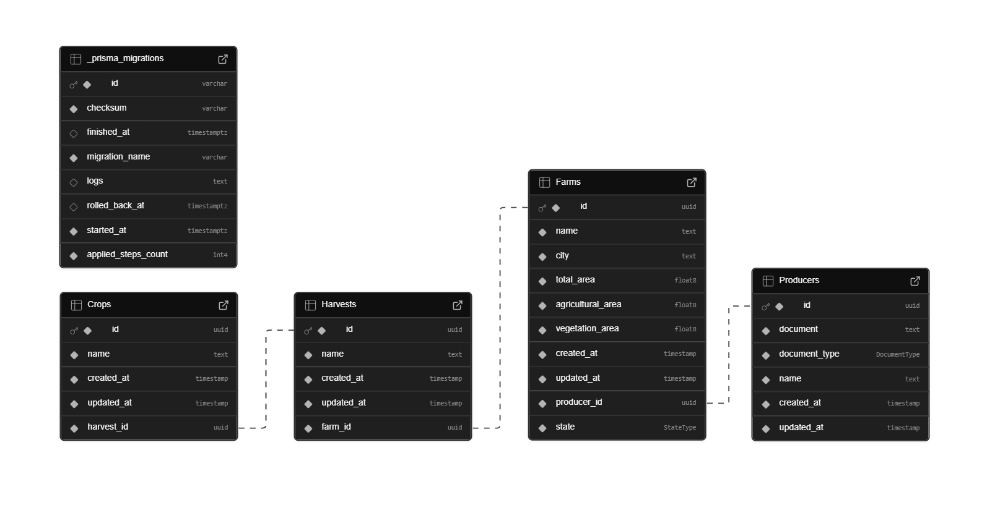

# Brain Agriculture API

## Descrição
Este projeto é uma API desenvolvida com **NestJS**, com o objetivo de gerenciar informações sobre fazendas, produtores, safras e culturas. A aplicação está configurada para executar em um ambiente Docker, com o banco de dados **PostgreSQL** também em container.

## Pré-requisitos
Antes de executar a aplicação, é necessário ter as seguintes ferramentas instaladas:
* Docker
* Docker Compose
* Node.js (para desenvolver e testar localmente)

## Configuração do Projeto

### Passos para Executar o Projeto
1. **Build e Start no Docker Compose**

Para executar a aplicação e o banco de dados em containers Docker, execute o seguinte comando:
```bash
docker compose up --build
```
```A instalação das dependências pode demorar um pouco```


2. **Verificando e usando a aplicação**

Depois de subir os containers, a API estará disponível em http://localhost:3000.

Para facilitar, as rotas podem ser acessadas e testadas através do endpoint http://localhost:3000/swagger.

Como nesse teste não foi abordado front-end, uma rota stats foi adicionada com informações que podem ser utilizadas em um dashboard.

3. **Prisma Studio**

Se desejar visualizar a base de dados, o serviço do Prisma Studio pode ser acessado através de http://localhost:5555.


### Como executar Testes
Primeiro execute `npm install` na raiz do projeto, após isso execute `npm run test:cov`.


### Configuração do Banco de Dados fora do ambiente Docker
Para testar fora do ambiente do Docker um arquivo `.env` com as variáveis `DATABASE_URL` e `DIRECT_URL` deve ser criado.
Durante a execução local, os dois valores podem ser idênticos. Porém, em outros ambientes (como por exemplo o Supabase) esses valores podem ser distintos.
Opcionalmente a dependência de directUrl pode ser removida do schema.prisma.

## Database
Diagrama ER simplificado, ilustrando a estrutura do banco de dados e seus principais relacionamentos.

